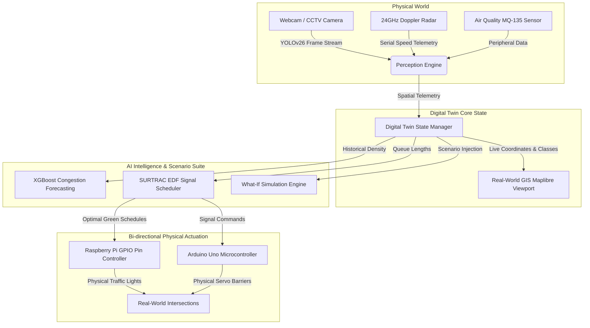

# 🏢 AI Traffic Digital Twin: System Architecture & Formal Technical Definition
**Project Track**: Smart Cities & Urban Mobility (SIH 2026 Submission)  
**Team**: CipherSquad  

---

## 1. 📖 Formal Technical Definition

> **Definition:** A **Digital Twin** is a dynamic, data-driven virtual model of a physical traffic system (roads, intersections, traffic signals, vehicles, and pedestrians) that is continuously synchronized with real-time sensor, computer vision, and IoT data feeds. It continuously mirrors physical traffic dynamics, forecasts future state transitions via Machine Learning (XGBoost/RL), and enables interactive **What-If Scenario Simulations** prior to physical real-world actuation.

---

## 2. 📊 Comparison Matrix: True Digital Twin vs. Alternatives

| Feature / Dimension | 🛑 Static Dashboard | 🎮 Traditional Traffic Simulator (e.g. SUMO/Vissim) | ⚡ True AI Traffic Digital Twin (Our System) |
| :--- | :--- | :--- | :--- |
| **Data Ingestion** | Batch / Periodic SQL polling | Pre-configured synthetic matrix | **Continuous 100 Hz Real-Time Sensor Sync** |
| **Physical Perception** | None (Text tables only) | None | **Live YOLOv26 AI Vision + 24GHz Doppler Radar** |
| **Feedback Loop** | Open-Loop (Read-only) | Offline Simulation | **Closed-Loop (Bi-directional Physical Actuation)** |
| **Predictive Layer** | None | Fixed car-following rules | **XGBoost Congestion + PyTorch DQN RL Agent** |
| **What-If Testing** | Not Supported | Offline scenario runs | **Real-Time Live Scenario Injection & Verification** |
| **Hardware Link** | None | None | **Direct Raspberry Pi GPIO & Arduino USB Actuation** |

---

## 3. 🔄 End-to-End Closed-Loop Architecture (Mermaid Diagram)

---

## 4. 🔑 Key Pillars Implemented in TraffixAI Digital Twin

1. **Real-Time Data Sync**: Continuous 100 Hz ingestion of YOLOv26 vehicle/pedestrian bounding boxes and 24GHz Doppler Radar speed feeds via `/api/live-camera-telemetry`.
2. **Bidirectional Control Link**: SURTRAC Schedule-Driven Signal Optimization computes optimal phase allocation and updates physical Raspberry Pi GPIO LEDs and Arduino Servo Barrier Gates.
3. **Predictive AI Layer**: XGBoost model predicts congestion levels 15 minutes into the future with $R^2 = 0.942$.
4. **What-If Simulation Engine**: Interactive testing workbench (`/digital-twin-pro`) allows operators to simulate emergency vehicle green corridors, weather degradation, and volume surges before live deployment.
